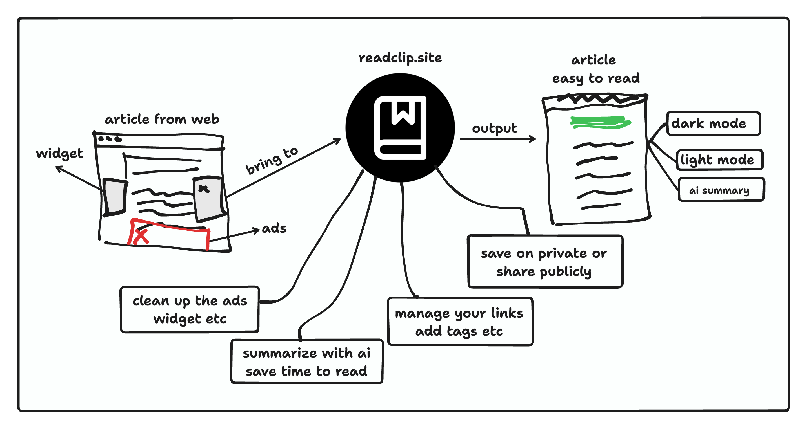

# ReadClip



ReadClip lets you save articles for later reading. Just add a link and Readclip scrapes and stores the full text and media. Tag your clips to organize and find them easily. Readclip removes ads and distractions so you can focus on content. Build your own personal, accessible knowledge library.


## Before and after ReadClip!

Before:
- It's hard to read news because of widgets, ads, and many other distractions.
- It's easy to forget something you have read online before.
- You save some links, but they become broken because the website is down or the content is removed.

After:

- Reading news or blog posts is easier than before.
- You no longer have to worry about forgetting articles you've read, as you can find them through tags or the hostnames of the links you've saved.
- No more losing broken links.

## Why?

I enjoy reading a lot. Every day, I spend about one or two hours reading anything from the internet, mostly blogs, news, and some social media. However, the web these days is very cluttered with ads and widgets everywhere. While I don't have an issue with website owners displaying ads to earn some money from the content they create, sometimes they don't consider us, the readers. They place ads in a way that prevents us from even being able to read the articles.

The objective of this project is to enhance the readability of those articles or blog posts. We will download the html content, then do some magic and turn it into markdown, and present it in a simple and clean manner, allowing for easier reading without any ads or distractions. You can choose between dark mode or light mode for your reading preference.

One issue I encountered while bookmarking and saving only the links is that sometimes they break due to the site owner forgetting to maintain the domain or removing the content. With the **ReadClip** project, we aim to address this by preserving the content. This way, even if the links are broken, we'll still have access to the text from those inaccessible sources.

## Stack

This project is a fullstack web app created using Golang for the backend and Vite with React for the frontend. It began as an experiment with Golang file embedding, and it has evolved into a practical bookmarking app that I find useful.

## Requirement

- go >= go1.19.2
- nodejs >= v20.3.0

## Local development

Make sure you have installed golang, and nodejs and to get up and running with the local development just run this command.

First install node dependencies in `ui` folder.

```bash
cd ui
pnpm run install
```

Run development server

```bash
make dev
```

Then visit this link:

- [http://localhost:8000](http://localhost:8000) - For Backend
- [http://localhost:3000](http://localhost:3000) - For UI react dev

## Installation

Clone this project

```bash
git clone git@github.com:ahmadrosid/readclip.git
```

Build UI:

```bash
cd ui
npm run build
```

Build binary, make sure you are in root folder first `cd ../` after build ui:

```bash
go build
```

Now you can run with this command:

```bash
./readclip
```

Install as standalone binary

```bash
go build
go install
```

If your global path is configured you can just run:

```bash
readclip
```

If you need to save article into you database you can enable it using postgres db, just extract the connection string

```bash
DB_CONNECTION_STRING="user=postgres password=postgres dbname=readclip host=your-posgres-host sslmode=verify-full"
```

If you are using docker you can use docker-compose to run the build and exec the container.

```bash
docker-compose up
```

## Roadmap

Some feature will be added soon.

- [x] Make it responsive
- [x] Tag system
- [x] Make it available on managed cloud (fly.io)
- [x] Filter saved links with tag
- [x] Paginate saved links
- [x] Authentication, with firebase
- [x] FREE TOOLS: Word Counter
- [x] FREE TOOLS: Reading timme estimator
- [x] FREE TOOLS: Get youtube transcriptions
- [x] FREE TOOLS: Markdown viewer
- [x] FREE TOOLS: Business Value Proposition Analysis
- [x] Daily Reading Digest (explore menu just like instagram etc)
- [x] Improve parsing code
- [ ] FullText search (Opensearch)
- [ ] Chrome Extensions?
- [ ] Email news letter subscriptions. [https://github.com/foxcpp/maddy](https://github.com/foxcpp/maddy)
- [ ] Blogs

## Marketing Materials

- [User Persona](https://founderpal.ai/user-persona-generator?persona=1BXO6H4579)
- [Your Value Proposition](https://founderpal.ai/value-proposition-generator?key=Z3KCH7S1AB)

## Affiliate

https://pika.style/?via=ahmad

